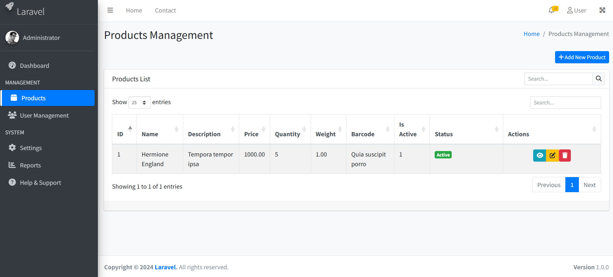

# Laravel CRUD Generator

A powerful Laravel package that automatically generates complete CRUD (Create, Read, Update, Delete) structure with repository pattern, service classes, and professional Bootstrap views. Save hours of development time with a single command!

## 🚀 Features

- **✅ Complete CRUD Structure** - Generates Models, Controllers, Views, Routes, and more
- **✅ Repository Pattern** - Automatic interface binding without touching `AppServiceProvider`
- **✅ Service Layer** - Clean business logic separation
- **✅ Professional UI** - Beautiful Bootstrap 5 views with DataTables
- **✅ API Ready** - Generates both Web and API controllers
- **✅ Audit Trail** - Automatic `created_by`, `updated_by`, `deleted_by` tracking
- **✅ Form Validation** - Automatic request validation classes
- **✅ Layout System** - Creates professional admin layout automatically
- **✅ Customizable Fields** - Support for various field types and validation
- **✅ Sample Data** - Optional sample data generation

## 📦 Installation

Install the package via Composer:

```bash
composer require aminul/crud-generate
```

That's it! No configuration needed.

## ⚡ Quick Start

Generate a complete CRUD for any model with a single command:

```bash
php artisan make:crud Product --fields="name:string,sku:string:unique,description:text,price:decimal,quantity:integer,is_active:boolean"
```

## 🎯 Usage Examples

### Basic Product CRUD

```bash
php artisan make:crud Product --fields="name:string,description:text,price:decimal,quantity:integer"
```

### E-commerce Product with Sample Data

```bash
php artisan make:crud Product --fields="name:string,sku:string:unique,description:text,price:decimal,compare_price:decimal,quantity:integer,weight:decimal,is_active:boolean,is_featured:boolean" --sample
```

### User Management

```bash
php artisan make:crud User --fields="name:string,email:string:unique,phone:string,address:text,is_active:boolean"
```

### Blog Post System

```bash
php artisan make:crud Post --fields="title:string,slug:string:unique,content:text,excerpt:text,featured_image:string,is_published:boolean,published_at:datetime"
```

## 🛠 Field Types Supported

| Type         | Description           | Example                   |
| ------------ | --------------------- | ------------------------- |
| `string`   | Short text (VARCHAR)  | `name:string`           |
| `text`     | Long text (TEXT)      | `description:text`      |
| `integer`  | Whole numbers         | `quantity:integer`      |
| `decimal`  | Decimal numbers       | `price:decimal`         |
| `boolean`  | True/False            | `is_active:boolean`     |
| `date`     | Date only             | `birth_date:date`       |
| `datetime` | Date and time         | `published_at:datetime` |
| `email`    | Email with validation | `email:string:unique`   |
| `:unique`  | Unique constraint     | `sku:string:unique`     |

## 📁 Generated Structure

When you run the command, it creates:

```
app/
├── Models/
│   ├── BaseModel.php          # Base model with audit trail
│   └── Product.php            # Your model
├── Repositories/
│   ├── Contracts/
│   │   └── ProductRepositoryInterface.php
│   └── ProductRepository.php
├── Services/
│   └── ProductService.php
├── Http/
│   ├── Controllers/
│   │   ├── ProductController.php
│   │   └── API/
│   │       └── ProductController.php
│   └── Requests/
│       ├── StoreProductRequest.php
│       └── UpdateProductRequest.php
resources/
└── views/
    ├── layouts/
    │   └── app.blade.php      # Professional admin layout
    └── product/
        ├── index.blade.php
        ├── create.blade.php
        ├── edit.blade.php
        └── show.blade.php
database/
└── migrations/
    └── 2024_01_01_000000_create_products_table.php
routes/
├── web.php                    # Web routes added
└── api.php                    # API routes added
```

## 🌐 Automatic Routes

**Web Routes:**

- `GET /products` - Product listing
- `GET /products/create` - Create form
- `POST /products` - Store product
- `GET /products/{id}` - Show product
- `GET /products/{id}/edit` - Edit form
- `PUT /products/{id}` - Update product
- `DELETE /products/{id}` - Delete product

**API Routes:**

- `GET /api/products` - List products
- `POST /api/products` - Create product
- `GET /api/products/{id}` - Show product
- `PUT /api/products/{id}` - Update product
- `DELETE /api/products/{id}` - Delete product

## 🎨 Professional UI Features

- **Bootstrap 5** - Modern responsive design
- **DataTables** - Advanced table with search, sort, pagination
- **Font Awesome** - Beautiful icons
- **SweetAlert2** - Elegant confirmation dialogs
- **Select2** - Enhanced select inputs
- **Sidebar Navigation** - Professional admin layout
- **Audit Information** - Track who created/updated records
- **Responsive Design** - Works on all devices

## 🔧 Advanced Usage

### Generate with Sample Data

```bash
php artisan make:crud Product --fields="name:string,description:text,price:decimal" --sample
```

### Custom Validation Rules

The package automatically generates validation rules based on field types:

- `string` → `required|string|max:255`
- `email` → `required|email`
- `decimal` → `required|numeric`
- `boolean` → `required|boolean`

### Repository Pattern Auto-Binding

The package automatically binds interfaces to repositories. No need to manually register in `AppServiceProvider`!

```php
// Automatically bound:
// ProductRepositoryInterface → ProductRepository
// UserRepositoryInterface → UserRepository
```

### API Controllers

RESTful API controllers are generated with proper JSON responses and error handling.

## 🚨 After Generation

1. **Run migrations:**

   ```bash
   php artisan migrate
   ```
2. **Access your CRUD:**

   - Web: Visit `/products`
   - API: Use `/api/products` endpoints
3. **Customize as needed** - All generated code follows Laravel best practices

## 🎯 Perfect For

- **Admin Panels** - Quick backend interfaces
- **Prototyping** - Rapid application development
- **MVP Development** - Get to market faster
- **Learning** - Study Laravel best practices
- **Team Projects** - Consistent code structure

[]()

## 🔄 Architecture

```
Controller → Service → Repository Interface → Repository → Model → Database
    ↓              ↓                    ↓           ↓        ↓
  Views      Business Logic      Contract      Data     Eloquent
                                  Layer      Access
```

## 📝 License

This package is open-sourced software licensed under the MIT license.

## 🤝 Contributing

Contributions are welcome! Please feel free to submit pull requests.

## 🐛 Issues

If you encounter any issues, please report them on the [GitHub repository](https://github.com/aminulbinnoor/laravel-crud-generate).

---

**⭐ Star the repository if you find this package helpful!**

**💡 Pro Tip:** Use the `--sample` flag when learning or demonstrating to see the CRUD in action with pre-filled data!

---

*Built with ❤️ for the Laravel community*
